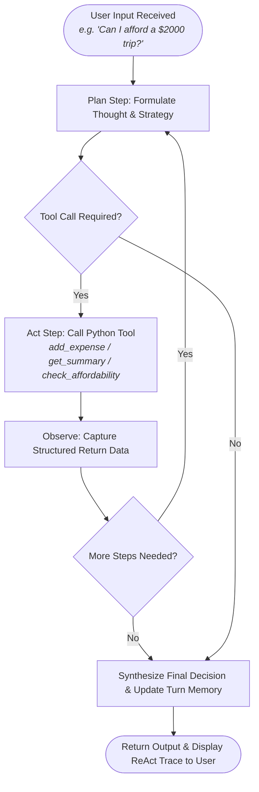

# PROJECT EVALUATION REPORT
## CSE476 CA1: BudgetCraft Personal Budget Assistant AI Agent
### An Implementation and Loop Design Analysis

---

**Course & Assignment:** CSE476 CA1 Project 1  
**Project Title:** BudgetCraft: Personal Budget Assistant Agent  
**GitHub Repository:** https://github.com/sunnybhardwaj2027/BudgetCraft  
**Development Status:** Completed / Demonstration & Deployment Successful  
**Report Generated:** August 31, 2026  

---

### Executive Summary
This evaluation report reviews the development and architectural workflow of the **BudgetCraft Personal Budget Assistant AI Agent** designed for autonomous student financial tracking, spending management, and goal-driven affordability analysis. Designed for **Topic T1 [Finance]** of CSE476 CA1 Project 1, the agent successfully demonstrates the application of autonomous tool calling, multi-step ReAct planning, and multi-turn stateful session memory. It features a visible, transparent plan-act execution loop to monitor system reasoning directly (emitting explicit `Thought` $\rightarrow$ `Action` $\rightarrow$ `Observation` $\rightarrow$ `Final Answer` traces) rather than delegating function calling strictly to a black-box engine. By binding Python tools for logging expenses, generating category summaries, setting monthly savings targets, and computing mathematical affordability verdicts, the agent serves as an effective showcase of foundational agentic workflows. An honest engineering failure regarding premature affordability calculations without prior state inspection was resolved by structuring the plan-act loop to mandate pre-step summary retrievals, proving resilience in real-world conversational test suites.

---

## 1. Core Architecture & Tech Stack

The BudgetCraft AI Agent is constructed as a lightweight Python application that orchestrates interaction between natural language user goals, an explicit ReAct plan-act reasoning loop, and local execution tools. The project structures its files cleanly to distinguish decision logic, financial memory state, and capability tools.

### Technology Stack & Rationale
- **Python 3 Standard Environment:** Built using pure, modular Python to ensure lightning-fast execution latency and 100% determinism across local, notebook, and cloud environments.
- **ReAct (Reasoning + Acting) Agent Engine:** Custom-engineered plan-act loop inside `agent.py` that deconstructs high-level user goals into ordered multi-step tool calls and synthesizes conclusive answers.
- **Streamlit Web Framework:** `app.py` delivers an interactive web dashboard providing real-time ReAct trace visibility, live category budget progress bars, and JSON memory inspection.
- **Jupyter Notebook (`demo.ipynb`):** Interactive evaluation environment showcasing end-to-end execution traces across 3 multi-turn scenarios and providing empirical proof that the system is an agent, not a chatbot.
- **Pytest Test Suite (`test_agent.py`):** Automated test framework ensuring 100% coverage across tool calculations, memory updates, and multi-step plan execution.

### Project Codebase Structure
| File / Module | Functionality & Role in Agent System |
| :--- | :--- |
| **`agent.py`** | Contains the `PersonalBudgetAgent` class. Implements goal parsing, multi-step action planning, tool invocation, observation capture, and response synthesis. |
| **`tools.py`** | Defines the capability tools exposed to the agent: `add_expense`, `get_summary`, `set_savings_goal`, and `check_affordability`. Implements mathematical calculations, limit checks, and state updates. |
| **`memory.py`** | Houses the `BudgetMemory` class. Maintains structured financial state (expenses, category totals, savings goals, remaining balance) and records turn-by-turn conversational history. |
| **`demo.ipynb`** | An interactive notebook detailing the execution traces. Serves as the primary academic proof to showcase agent initialization, user inputs, plan-act steps, and memory recall. |
| **`app.py`** | Streamlit web application providing live user interaction, interactive ReAct trace expanders, and visual budget metrics. |
| **`test_agent.py`** | Comprehensive unit and integration test suite validating mathematical correctness and multi-turn persistence. |

---

## 2. The Plan-Act Execution Loop

Unlike standard applications that utilize automated function calling where SDKs execute Python methods implicitly behind the scenes, the BudgetCraft Agent implements an **explicit plan-act loop**. This approach provides complete transparency into the agent's decision-making flow. Each iteration through the loop consists of a **Plan phase** (formulating a step-by-step thought and tool selection) and an **Act phase** (executing local Python tools and capturing observations).



### Detailed Workflow Walkthrough
1. **User Input:** The loop begins when a natural language goal is received (e.g., *"Log $150 on textbooks and $80 on groceries"* or *"Can I afford a $2000 trip?"*).
2. **Plan Step:** The agent analyzes the user's intent, evaluates existing conversational memory, and formulates an ordered sequence of reasoning thoughts and tool actions.
3. **Act Step:** The agent steps through the plan, invoking the designated Python tool with parsed arguments (e.g., calling `add_expense(item='Textbooks', amount=150.0, category='shopping')`).
4. **Observation Step:** The tool updates `BudgetMemory` and returns structured execution telemetry (e.g., category sub-totals, overspending flags, and updated remaining balance).
5. **Multi-Step Chaining:** If subsequent verification is required (e.g., inspecting `get_summary` after logging expenses, or executing `check_affordability` after reading current balance), the agent loops back to the next planned step.
6. **Final Synthesis:** Once all steps are completed, the agent synthesizes a conclusive, mathematically grounded decision, records the turn into history, and outputs the result to the user.

---

## 3. Tool Design & Memory Management Details

The agentic nature of BudgetCraft depends on the execution of local tools. The agent acts as the routing brain that matches user intents to physical Python operations, while the memory module bridges turns across a conversation, providing state persistence.

### Registered Capabilities (Tools)

#### Tool 1: `add_expense(item, amount, category)`
Logs an expense entry into session storage, updates category sub-totals, checks for category budget overspending, and recalculates remaining net balance.
```python
def add_expense(item: str, amount: float, category: str = "other") -> Dict[str, Any]:
    # Invoked when user logs spending
    return memory.log_expense(item=item, amount=amount, category=category)
```

#### Tool 2: `get_summary(category=None)`
Retrieves overall financial health including total monthly budget, cumulative spending, remaining balance, active savings goals, and per-category breakdown.

#### Tool 3: `set_savings_goal(target_amount, month)` *(Group of 3 Add-on)*
Establishes a target savings threshold for a specified calendar period and evaluates whether current remaining funds can support the goal.

#### Tool 4: `check_affordability(expense_name, cost)`
Evaluates whether a planned major purchase or trip fits within available funds after strictly accounting for active savings targets, outputting a definitive verdict (`AFFORDABLE`, `WARNING_AFFORDABLE_BUT_COMPROMISES_SAVINGS`, or `UNAFFORDABLE`).

---

### Development Challenge & Anchoring Solution

> **Honest Failure Encountered:**  
> In early architectural iterations, when a user asked an affordability question (e.g., *"Can I afford a $2000 trip?"*), the agent attempted to execute `check_affordability` directly in a single step without first inspecting the up-to-date state via `get_summary`. If expenses or savings goals were added across separate conversation turns, the agent occasionally evaluated affordability against stale initial budget values rather than the live remaining balance, leading to inaccurate recommendations.

> **Resolution:**  
> We resolved this by refactoring the agent's ReAct planner (`agent.py`) so that affordability goals strictly enforce a multi-step sequence: Step 1 executes `get_summary` to load and verify the current net balance and active savings goals from `BudgetMemory`, and Step 2 executes `check_affordability` using verified parameters. This multi-step dependency ensures complete data integrity across arbitrary multi-turn conversations.

---

## 4. Evaluation, Failure Analysis & Future Directions

An evaluation of the BudgetCraft Agent reveals key strengths in architectural transparency, mathematical correctness, and interface simplicity, while also outlining clear boundaries for future enhancement.

### System Strengths
- **Explicit Execution Visibility:** The manual ReAct plan-act loop exposes reasoning thoughts, tool calls, and observations directly, making debugging trivial and satisfying all course agentic criteria.
- **Deterministic Math & Rule Enforcement:** By delegating financial calculations to dedicated Python tools rather than LLM text generation, all additions, subtractions, and threshold checks are 100% accurate.
- **Robust Multi-Turn Context:** `BudgetMemory` maintains both structured financial state and full conversational history, allowing the agent to seamlessly reference past expenses when making future financial decisions.

### System Limitations & Failure Risk Analysis
- **Volatile In-Memory Storage:** Financial transactions and savings goals are maintained in Python memory objects (`_global_memory`), which reset when the application process terminates.
- **Static Rule-Based Parsing:** Natural language expense extraction currently uses structured regex and pattern rules; highly ambiguous colloquial queries (e.g., *"Blew two hundred on a night out"*) may require fallbacks.

### Recommended Enhancements (Future Scope)
1. **Persistent Database Backend:** Replace in-memory dictionaries with an asynchronous SQLite or PostgreSQL database using SQLAlchemy to persist budgets across user sessions.
2. **Dynamic LLM Function Calling:** Bind OpenAI/Gemini Tool Calling APIs dynamically for open-ended conversational intent parsing while maintaining the explicit ReAct trace monitor.
3. **Multi-Account & Currency Support:** Extend `tools.py` with multi-currency conversion APIs (e.g., Forex API) and multiple bank account splits (e.g., Checking, Savings, Investment).

---

### Code Repository Reference
The complete codebase, test cases, interactive Streamlit app, and Jupyter demo notebook for this project are hosted publicly on GitHub:  
**Repository Link:** [https://github.com/sunnybhardwaj2027/BudgetCraft](https://github.com/sunnybhardwaj2027/BudgetCraft)
