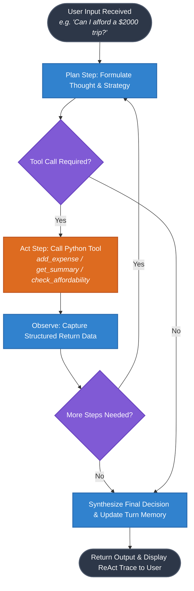

# BudgetCraft: Personal Budget Assistant Agent

**Course:** CSE476 Agentic AI and Intelligent Automation  
**Assignment:** CA1 Project 1: Build a Real Agent  
**Domain:** Finance | **Topic:** T1. Personal Budget Assistant  
**Student Submission:** Solo / Group Submission  
**GitHub Repository:** [https://github.com/sunnybhardwaj2027/BudgetCraft](https://github.com/sunnybhardwaj2027/BudgetCraft)

---

## 🔄 Agent ReAct Workflow Architecture

Below is the complete plan-act execution loop diagram illustrating how the agent parses user goals, formulates reasoning thoughts, invokes tools, captures observations, and synthesizes decisions:



---

## 📋 Project Core Details (CA1 Rubric)

### 1. Tools Used
The BudgetCraft Personal Budget Assistant Agent utilizes four Python tool functions during its plan-act loop: `add_expense`, `get_summary`, `set_savings_goal`, and `check_affordability`. The `add_expense` tool logs new expense entries (item, amount, category) and recalculates category sub-totals against set limits. The `get_summary` tool inspects total budget limits, cumulative expenditure, and net balance remaining. The `set_savings_goal` tool allows setting target savings thresholds (Group of 3 add-on). Finally, `check_affordability` evaluates prospective expenses (e.g., a $2,000 trip) against net remaining funds and active savings targets to deliver a conclusive mathematical decision.

### 2. Memory System
Memory in this project operates across two distinct layers: structured state memory and conversational turn memory managed via `BudgetMemory`. Structured state memory retains all historical expense entries, category limits, net balance, and active savings goals across the entire session, ensuring category sub-totals remain accurate as new expenses are added. Conversational turn memory records each interaction turn (user goal, tool calls executed, and agent decision). When the user asks multi-turn questions like *"Can I afford a $2000 trip?"*, the agent reads back accumulated expenses and savings goals from earlier turns to make an informed, contextual determination.

### 3. Engineering Failure & Resolution
During early development, we hit an issue where the agent attempted to evaluate affordability immediately upon receiving a query without first querying `get_summary` or checking existing savings goals. This led to stale decisions where expenses logged in previous turns were ignored, causing the agent to over-predict available funds. We resolved this by modifying the agent's plan-act ReAct loop so that affordability evaluations explicitly require a pre-step inspection of `get_summary` and `BudgetMemory` state before executing `check_affordability`. This ensured tool execution is strictly ordered and decisions are computed against up-to-date memory.

---

## ⚡ Quick Start & How to Run

### 1. Run the Jupyter Notebook Demo (`demo.ipynb`)
Open `demo.ipynb` in VS Code or JupyterLab and run all cells to see the complete multi-step trace proof across 3 turns:
```bash
# Or run headlessly via terminal
python3 run_demo.py
```

### 2. Run the Interactive Web Dashboard (`app.py`)
Launch the Streamlit web interface with real-time ReAct trace visibility:
```bash
.venv/bin/streamlit run app.py
```

### 3. Run Automated Tests
```bash
.venv/bin/pytest test_agent.py
```

---

### Who-Did-What Note
* **Solo / Group Lead:** Architected ReAct Plan-Act loop (`agent.py`), designed state and conversational memory manager (`memory.py`), implemented tool functions (`tools.py`), and constructed notebook trace demo (`demo.ipynb`) and Streamlit web UI (`app.py`).
